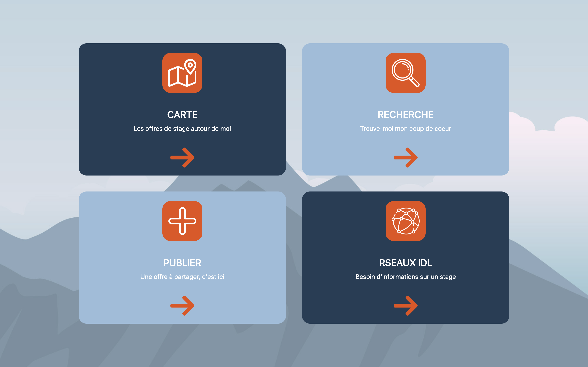
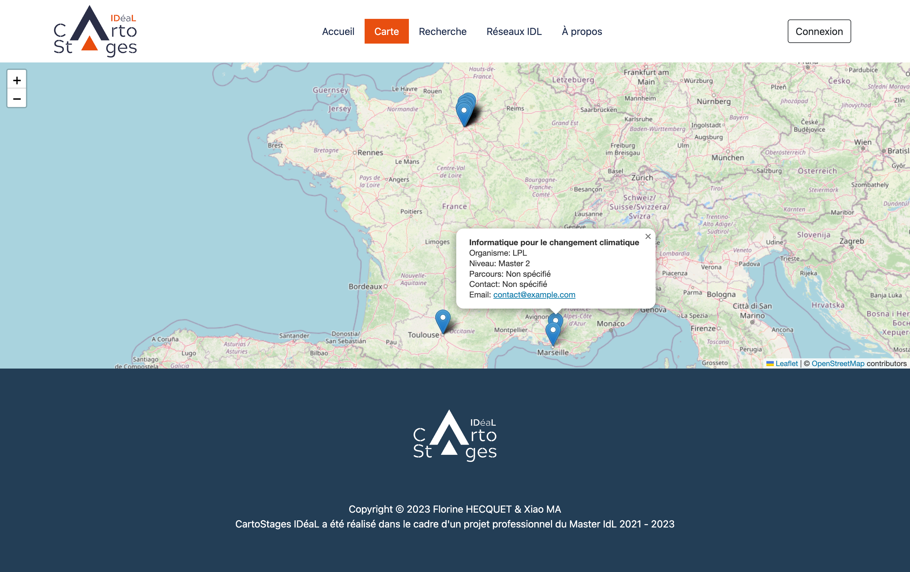
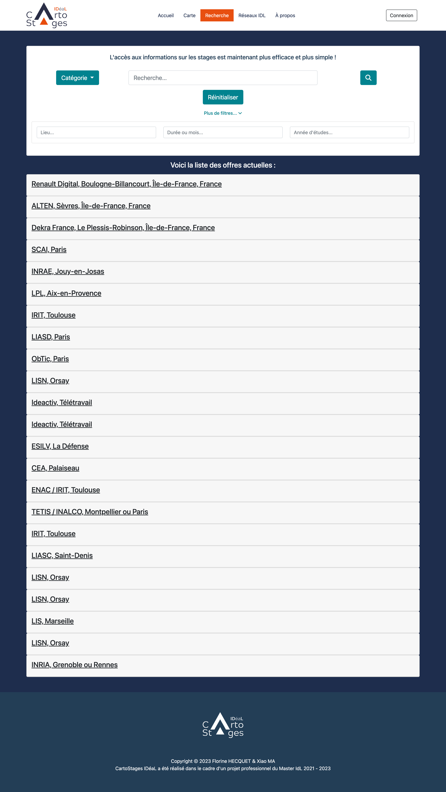
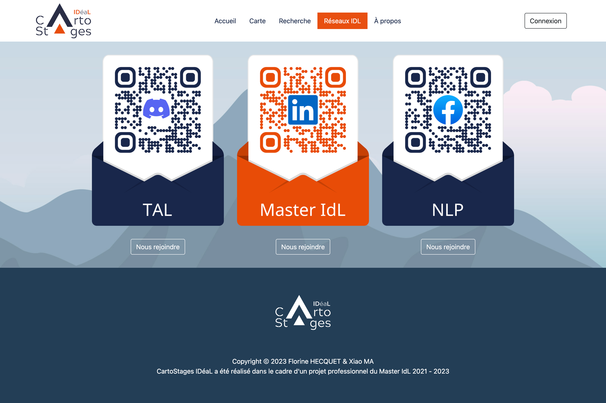
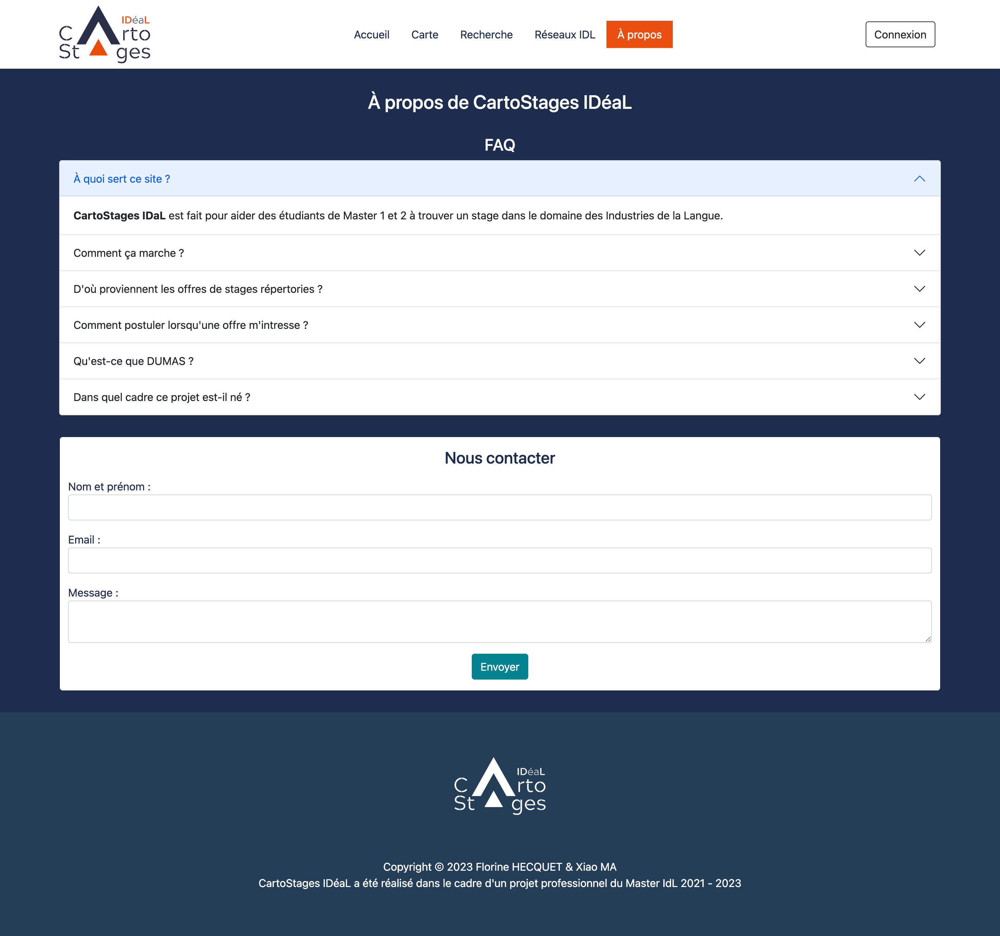
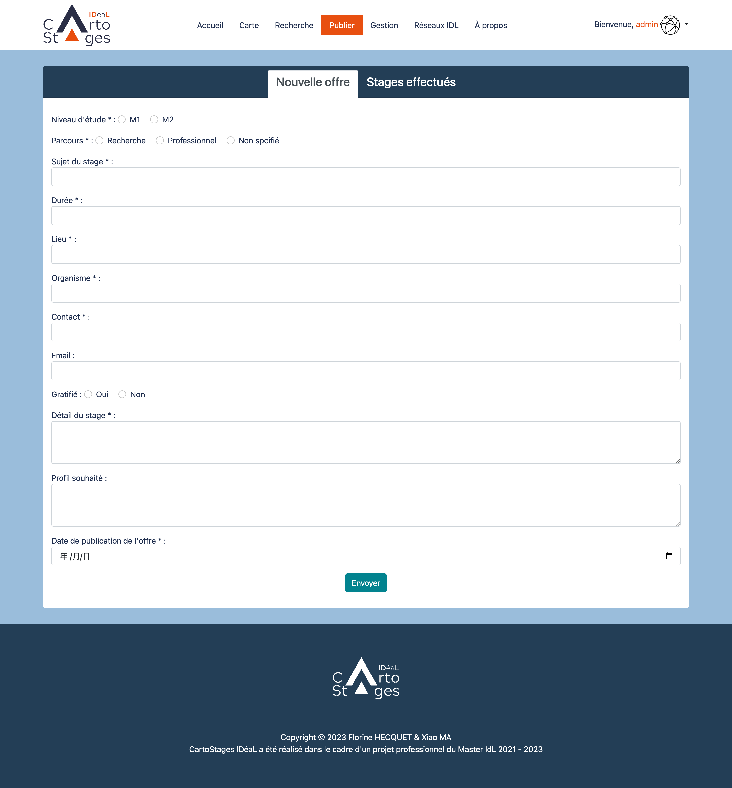
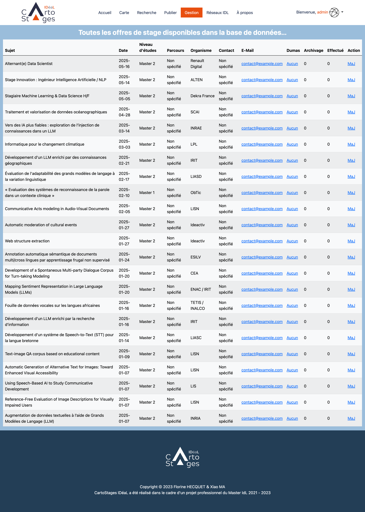
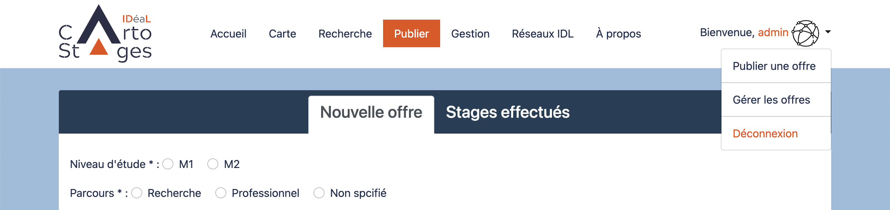
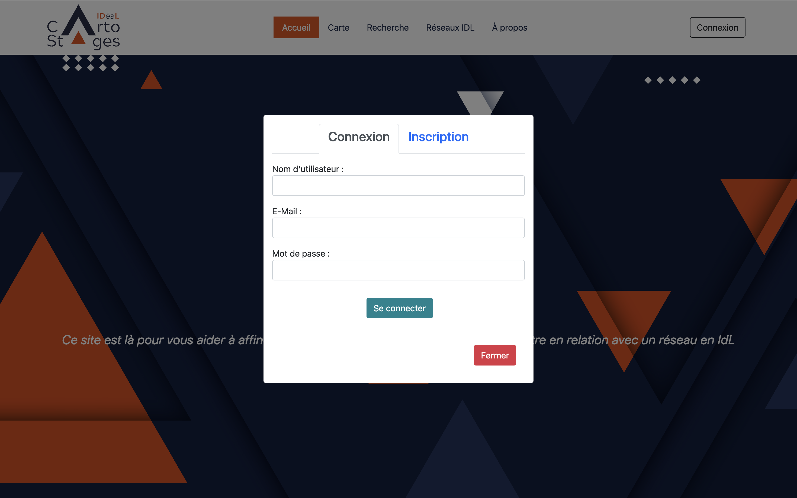

# CartoStages IDéaL

## Description du projet

CartoStages IDéaL est une plateforme web dédiée à la collecte, la visualisation et la gestion des offres de stages en France, en particulier pour les étudiants du Master IdL (Ingénierie des Langues) de l'Université Grenoble Alpes. Le projet permet de recenser des offres de stages provenant de différentes sources, d'afficher ces offres sur une carte interactive, et de proposer des fonctionnalités de recherche et de gestion aux utilisateurs et aux administrateurs.

## Fonctionnalités principales

* Affichage des offres de stages sur une carte interactive avec la localisation géographique des organismes.
* Recherche avancée par mot-clé, lieu, durée, niveau d'études.
* Publication et gestion des offres (réservé aux administrateurs).
* Visualisation des réseaux de stages et accès aux informations sur les partenaires académiques.
* Connexion et inscription des utilisateurs.

## Pages de l'application

### Accueil

Affichage des dernières offres de stages et présentation du projet.


### Accueil (Admin)

Affichage des dernières offres de stages avec accès à la publication pour les administrateurs.



### Carte

Carte interactive affichant les lieux de stages avec des marqueurs et des informations détaillées sur chaque offre.



### Recherche

Page permettant de rechercher des offres selon différents critères (lieu, durée, niveau, mots-clés).



### Réseaux IDL

Présentation des partenaires académiques et professionnels du Master IdL.



### À propos

Informations sur le projet et les auteurs.



### Publier (Admin)

Page réservée aux administrateurs pour publier de nouvelles offres de stage.



### Gestion (Admin)

Gestion des offres publiées : modification, suppression et archivage.



### Publier (Admin)

Page réservée aux administrateurs pour publier de nouvelles offres de stage après connexion.



### Connexion et Inscription

Fenêtre modale permettant aux utilisateurs de se connecter ou de créer un compte.



## Installation et exécution en local

### Prérequis

* Docker et Docker Compose

### Étapes

1. Cloner le dépôt GitHub :

```
git clone https://github.com/DJOMIDO/cartostagesideal.git
```

2. Accéder au répertoire du projet :

```
cd cartostagesideal
```

3. Démarrer les services Docker :

```
docker-compose up --build
```

4. Accéder à l'application dans votre navigateur :

```
http://localhost:8000
```

5. Accéder à PhpMyAdmin pour gérer la base de données :

```
http://localhost:8080
```

## Auteurs

* Florine HECQUET
* Xiao MA

## Licence

Ce projet est réalisé dans le cadre du Master IdL 2021-2023 et est sous licence MIT.
